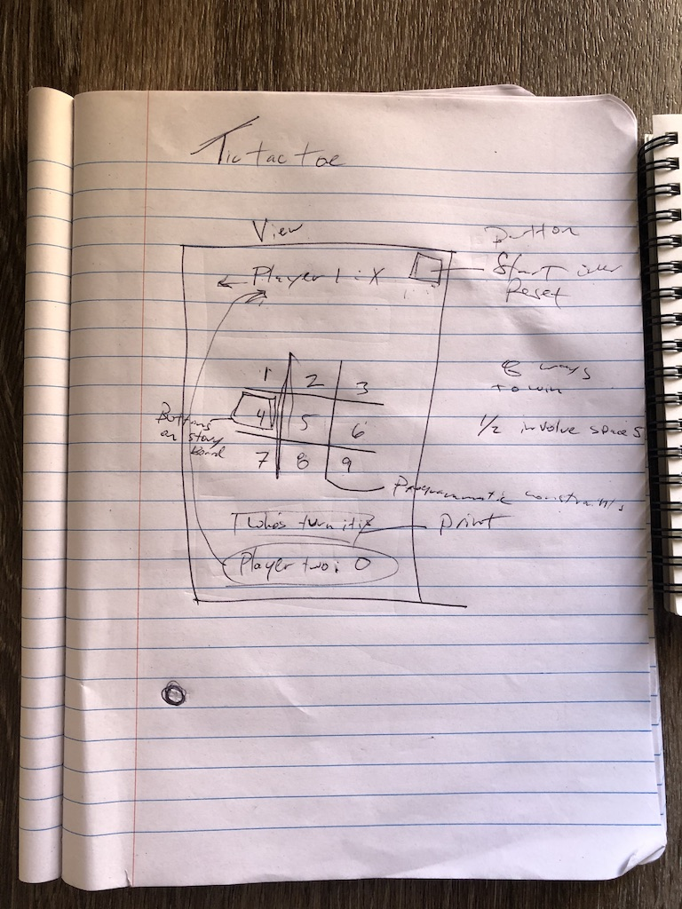
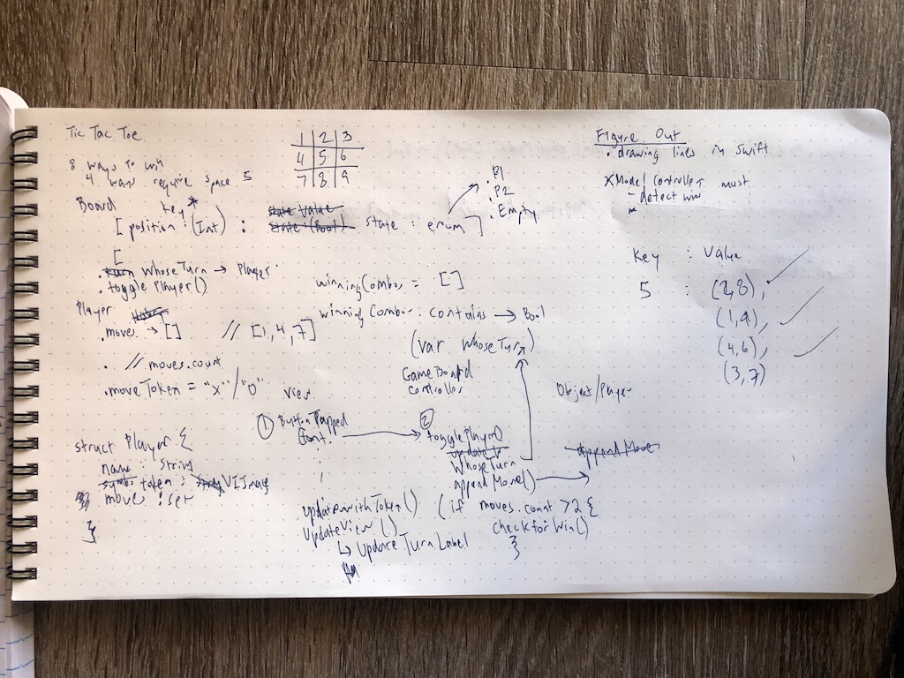

# TicTacToe (Student Project)

An iOS app built from scratch by Colby Harris (@greeceball) and Theo Vora (@theevo).

## Specs

Xcode version: 11.4
Language: Swift 5

## Learning Objectives

Our main goal for this project was getting experience with git merge. We divided our tasks, practiced simultaneous development, and submitted pull requests to the the `develop` branch.

Our secondary goal was getting experience with programmatic constraints. The app uses a hybrid of both Storyboard and traditional programmatic constraints.

## Planning

We started off on paper and identified several problems when thinking about how the app would detect a win.

